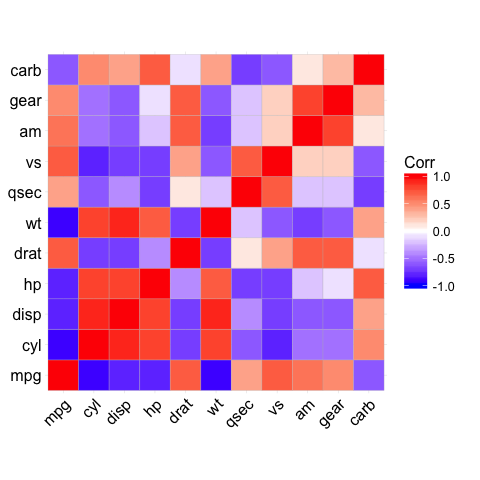
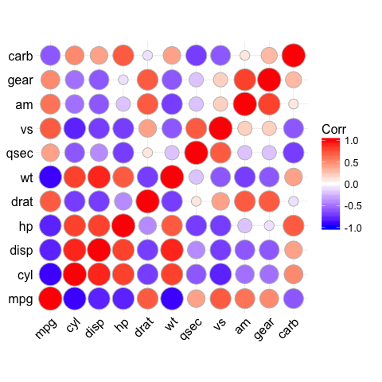
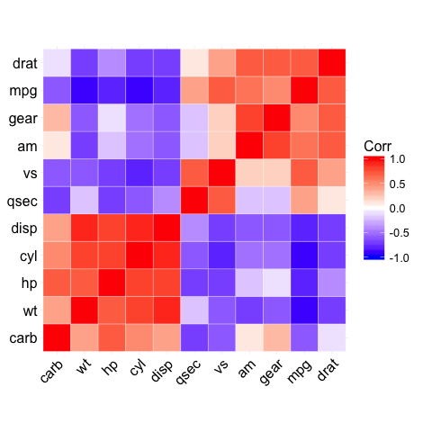
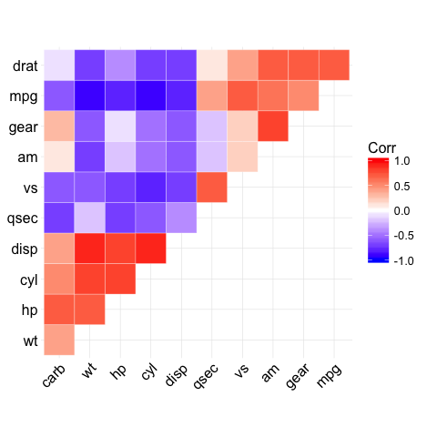
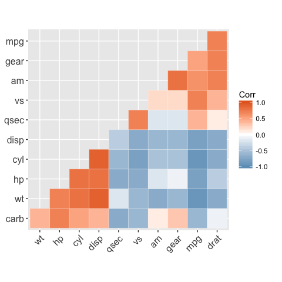
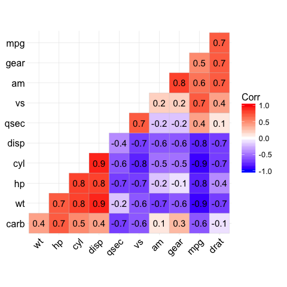
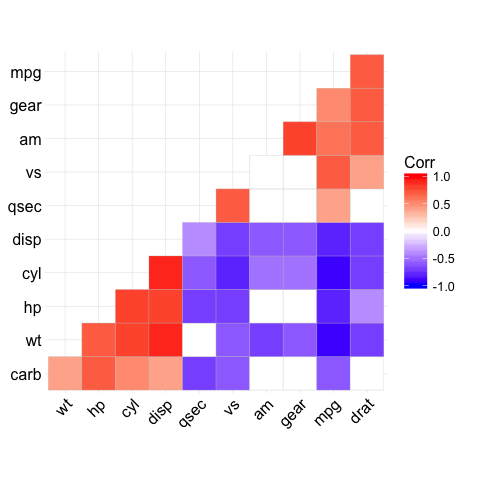

<!-- README.md is generated from README.Rmd. Please edit that file -->
ggcorrplot: Visualization of a correlation matrix using ggplot2
===============================================================

The **ggcorrplot** package can be used to **visualize easily** a **correlation matrix** using **ggplot2**. It provides solution for **reordering** the correlation matrix and displays the **significance level** on the correlogram. It includes also a function for computing a matrix of **correlation p-values**. It's inspired from the package [corrplot](http://www.sthda.com/english/wiki/visualize-correlation-matrix-using-correlogram).

Find out more at <http://www.sthda.com/english/ggcorrplot>.

Installation and loading
------------------------

``` r
# Install
if(!require(devtools)) install.packages("devtools")
devtools::install_github("kassambara/ggcorrplot")
```

``` r
# Loading
library(ggcorrplot)
#> Loading required package: ggplot2
```

Getting started
---------------

### Compute a correlation matrix

The *mtcars* data set will be used in the following R code. The function **cor\_pmat()** [in **ggcorrplot**] computes a matrix of correlation p-values.

``` r
# Compute a correlation matrix
data(mtcars)
corr <- round(cor(mtcars), 1)
corr
#>       mpg  cyl disp   hp drat   wt qsec   vs   am gear carb
#> mpg   1.0 -0.9 -0.8 -0.8  0.7 -0.9  0.4  0.7  0.6  0.5 -0.6
#> cyl  -0.9  1.0  0.9  0.8 -0.7  0.8 -0.6 -0.8 -0.5 -0.5  0.5
#> disp -0.8  0.9  1.0  0.8 -0.7  0.9 -0.4 -0.7 -0.6 -0.6  0.4
#> hp   -0.8  0.8  0.8  1.0 -0.4  0.7 -0.7 -0.7 -0.2 -0.1  0.7
#> drat  0.7 -0.7 -0.7 -0.4  1.0 -0.7  0.1  0.4  0.7  0.7 -0.1
#> wt   -0.9  0.8  0.9  0.7 -0.7  1.0 -0.2 -0.6 -0.7 -0.6  0.4
#> qsec  0.4 -0.6 -0.4 -0.7  0.1 -0.2  1.0  0.7 -0.2 -0.2 -0.7
#> vs    0.7 -0.8 -0.7 -0.7  0.4 -0.6  0.7  1.0  0.2  0.2 -0.6
#> am    0.6 -0.5 -0.6 -0.2  0.7 -0.7 -0.2  0.2  1.0  0.8  0.1
#> gear  0.5 -0.5 -0.6 -0.1  0.7 -0.6 -0.2  0.2  0.8  1.0  0.3
#> carb -0.6  0.5  0.4  0.7 -0.1  0.4 -0.7 -0.6  0.1  0.3  1.0

# Compute a matrix of correlation p-values
p.mat <- cor_pmat(mtcars)
p.mat
#>               mpg          cyl         disp           hp         drat
#> mpg  0.000000e+00 6.112687e-10 9.380327e-10 1.787835e-07 1.776240e-05
#> cyl  6.112687e-10 0.000000e+00 1.803002e-12 3.477861e-09 8.244636e-06
#> disp 9.380327e-10 1.803002e-12 0.000000e+00 7.142679e-08 5.282022e-06
#> hp   1.787835e-07 3.477861e-09 7.142679e-08 0.000000e+00 9.988772e-03
#> drat 1.776240e-05 8.244636e-06 5.282022e-06 9.988772e-03 0.000000e+00
#> wt   1.293959e-10 1.217567e-07 1.222311e-11 4.145827e-05 4.784260e-06
#> qsec 1.708199e-02 3.660533e-04 1.314404e-02 5.766253e-06 6.195826e-01
#> vs   3.415937e-05 1.843018e-08 5.235012e-06 2.940896e-06 1.167553e-02
#> am   2.850207e-04 2.151207e-03 3.662114e-04 1.798309e-01 4.726790e-06
#> gear 5.400948e-03 4.173297e-03 9.635921e-04 4.930119e-01 8.360110e-06
#> carb 1.084446e-03 1.942340e-03 2.526789e-02 7.827810e-07 6.211834e-01
#>                wt         qsec           vs           am         gear
#> mpg  1.293959e-10 1.708199e-02 3.415937e-05 2.850207e-04 5.400948e-03
#> cyl  1.217567e-07 3.660533e-04 1.843018e-08 2.151207e-03 4.173297e-03
#> disp 1.222311e-11 1.314404e-02 5.235012e-06 3.662114e-04 9.635921e-04
#> hp   4.145827e-05 5.766253e-06 2.940896e-06 1.798309e-01 4.930119e-01
#> drat 4.784260e-06 6.195826e-01 1.167553e-02 4.726790e-06 8.360110e-06
#> wt   0.000000e+00 3.388683e-01 9.798492e-04 1.125440e-05 4.586601e-04
#> qsec 3.388683e-01 0.000000e+00 1.029669e-06 2.056621e-01 2.425344e-01
#> vs   9.798492e-04 1.029669e-06 0.000000e+00 3.570439e-01 2.579439e-01
#> am   1.125440e-05 2.056621e-01 3.570439e-01 0.000000e+00 5.834043e-08
#> gear 4.586601e-04 2.425344e-01 2.579439e-01 5.834043e-08 0.000000e+00
#> carb 1.463861e-02 4.536949e-05 6.670496e-04 7.544526e-01 1.290291e-01
#>              carb
#> mpg  1.084446e-03
#> cyl  1.942340e-03
#> disp 2.526789e-02
#> hp   7.827810e-07
#> drat 6.211834e-01
#> wt   1.463861e-02
#> qsec 4.536949e-05
#> vs   6.670496e-04
#> am   7.544526e-01
#> gear 1.290291e-01
#> carb 0.000000e+00
```

Correlation matrix visualization
--------------------------------

``` r
# Visualize the correlation matrix
# --------------------------------
# method = "square" or "circle"
ggcorrplot(corr)
```



``` r
ggcorrplot(corr, method = "circle")
```



``` r

# Reordering the correlation matrix
# --------------------------------
# using hierarchical clustering
ggcorrplot(corr, hc.order = TRUE, outline.col = "white")
```



``` r

# Types of correlogram layout
# --------------------------------
# Get the lower triangle
ggcorrplot(corr, hc.order = TRUE, type = "lower",
     outline.col = "white")
```


``` r
# Get the upeper triangle
ggcorrplot(corr, hc.order = TRUE, type = "upper",
     outline.col = "white")
```



``` r

# Change colors and theme
# --------------------------------
# Argument colors
ggcorrplot(corr, hc.order = TRUE, type = "lower",
   outline.col = "white",
   ggtheme = ggplot2::theme_gray,
   colors = c("#6D9EC1", "white", "#E46726"))
```



``` r

# Add correlation coefficients
# --------------------------------
# argument lab = TRUE
ggcorrplot(corr, hc.order = TRUE, type = "lower",
   lab = TRUE)
```



``` r

# Add correlation significance level
# --------------------------------
# Argument p.mat
# Barring the no significant coefficient
ggcorrplot(corr, hc.order = TRUE,
    type = "lower", p.mat = p.mat)
```


``` r
# Leave blank on no significant coefficient
ggcorrplot(corr, p.mat = p.mat, hc.order = TRUE,
    type = "lower", insig = "blank")
```


