<!-- README.md is generated from README.Rmd. Please edit that file -->

[](https://github.com/kassambara/ggcorrplot/actions)
[](https://cran.r-project.org/package=ggcorrplot)
[](https://cran.r-project.org/web/checks/check_results_ggcorrplot.html)
[](https://cran.r-project.org/package=ggcorrplot)
[](https://cranlogs.r-pkg.org/badges/grand-total/ggcorrplot)

# ggcorrplot: Visualization of a correlation matrix using ggplot2

**ggcorrplot** draws a correlation matrix as a **ggplot2** plot. Because
the result is a plain ggplot object, you can restyle it, annotate it,
and combine it with other layers using the usual `+` syntax.

It can:

  - reorder the matrix by **hierarchical clustering** and outline the
    clusters,
  - show only the **lower** or **upper** triangle, or a **mixed** layout
    with a different glyph per triangle,
  - overlay the **correlation coefficients** and mark the
    **statistically significant** cells (including a standalone
    **significance map**), and
  - compute the matrix of **correlation p-values** with `cor_pmat()`.

Learn more at
<https://www.sthda.com/english/wiki/ggcorrplot-visualization-of-a-correlation-matrix-using-ggplot2>.

## Installation

Install the released version from CRAN:

``` r
install.packages("ggcorrplot")
```

Or the development version from GitHub:

``` r
if (!require(devtools)) install.packages("devtools")
devtools::install_github("kassambara/ggcorrplot")
```

``` r
library(ggcorrplot)
```

## Getting started

The examples below use the `mtcars` data set. `cor()` builds the
correlation matrix and `cor_pmat()` \[in **ggcorrplot**\] computes the
matrix of correlation p-values.

``` r
data(mtcars)
corr <- round(cor(mtcars), 1)
corr[1:4, 1:4]
#>       mpg  cyl disp   hp
#> mpg   1.0 -0.9 -0.8 -0.8
#> cyl  -0.9  1.0  0.9  0.8
#> disp -0.8  0.9  1.0  0.8
#> hp   -0.8  0.8  0.8  1.0

# Matrix of correlation p-values
p.mat <- cor_pmat(mtcars)
p.mat[1:4, 1:4]
#>               mpg          cyl         disp           hp
#> mpg  0.000000e+00 6.112687e-10 9.380327e-10 1.787835e-07
#> cyl  6.112687e-10 0.000000e+00 1.802838e-12 3.477861e-09
#> disp 9.380327e-10 1.802838e-12 0.000000e+00 7.142679e-08
#> hp   1.787835e-07 3.477861e-09 7.142679e-08 0.000000e+00
```

## Correlation matrix visualization

The default draws each correlation as a colored square; `method =
"circle"` encodes the value with the circle area instead.

``` r
ggcorrplot(corr)
ggcorrplot(corr, method = "circle")
```

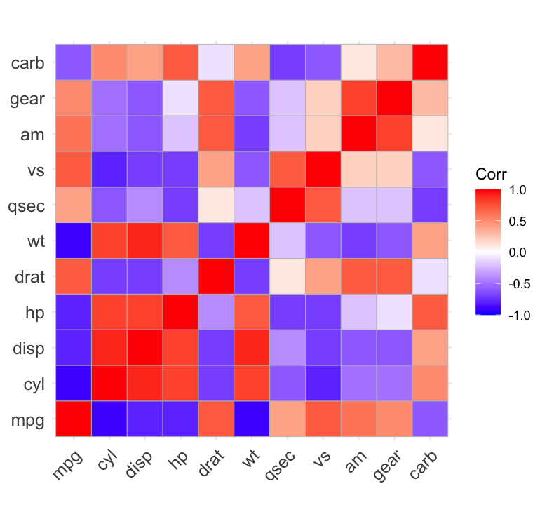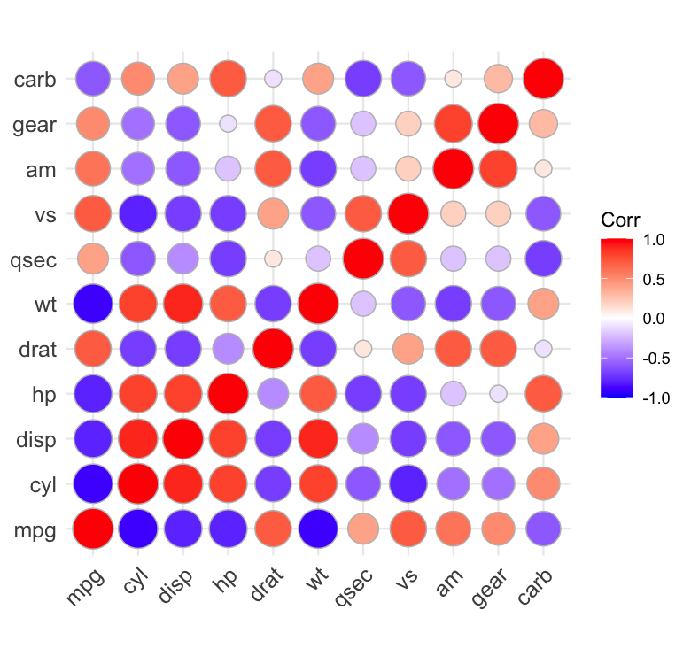

### Sized glyphs in boxed cells

`scale.square = TRUE` sizes the squares by the absolute correlation, so
strong correlations dominate; `cell.grid = TRUE` draws a light box
around every cell so the glyphs sit inside a grid instead of floating on
the axis lines.

``` r
ggcorrplot(corr, scale.square = TRUE, cell.grid = TRUE, outline.color = "white")
ggcorrplot(corr, method = "circle", cell.grid = TRUE)
```

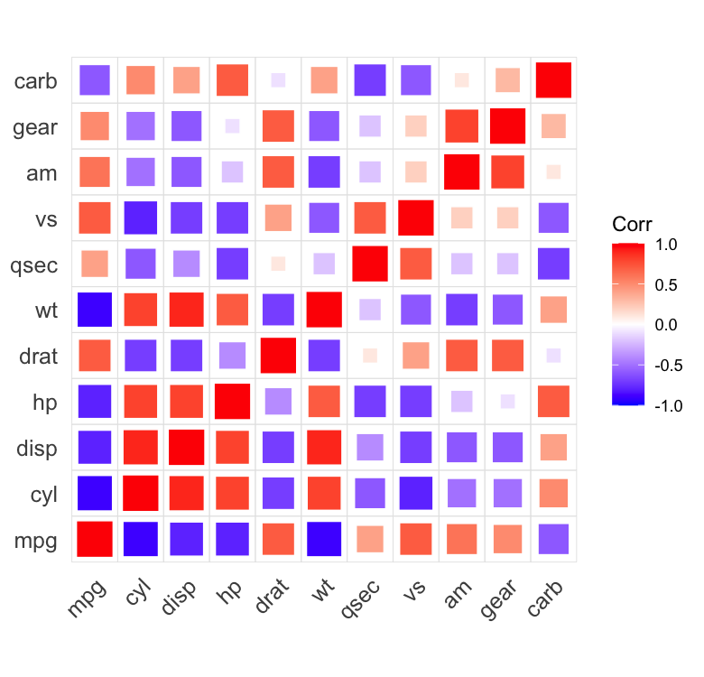

### Reorder by clustering, and outline the clusters

`hc.order = TRUE` reorders the variables by hierarchical clustering so
that correlated variables sit together. `hc.rect` then draws rectangles
around the clusters obtained by cutting the tree.

``` r
ggcorrplot(corr, hc.order = TRUE, outline.color = "white")
ggcorrplot(corr, hc.order = TRUE, hc.rect = 3, outline.color = "white")
```

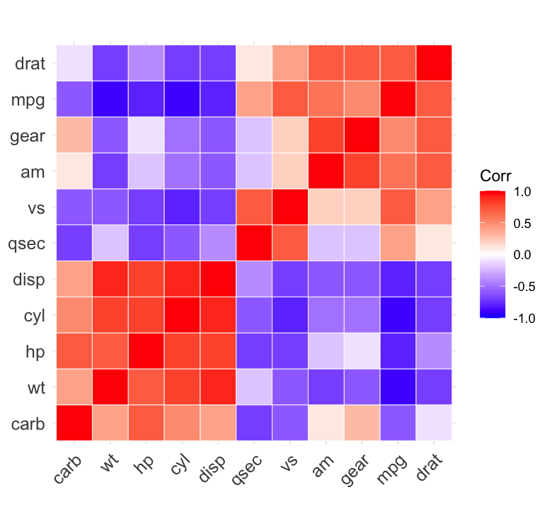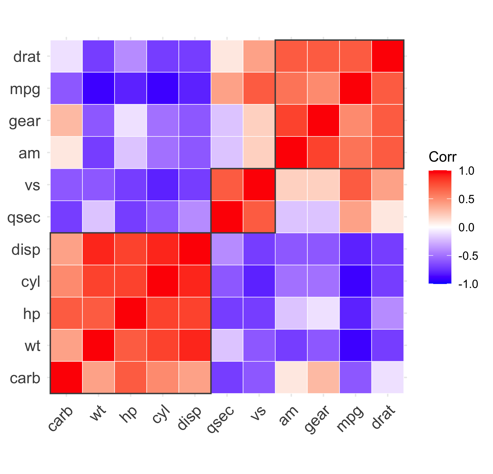

### Lower / upper triangle

For a symmetric matrix the two triangles are redundant, so you can keep
just one.

``` r
ggcorrplot(corr, hc.order = TRUE, type = "lower", outline.color = "white")
ggcorrplot(corr, hc.order = TRUE, type = "upper", outline.color = "white")
```

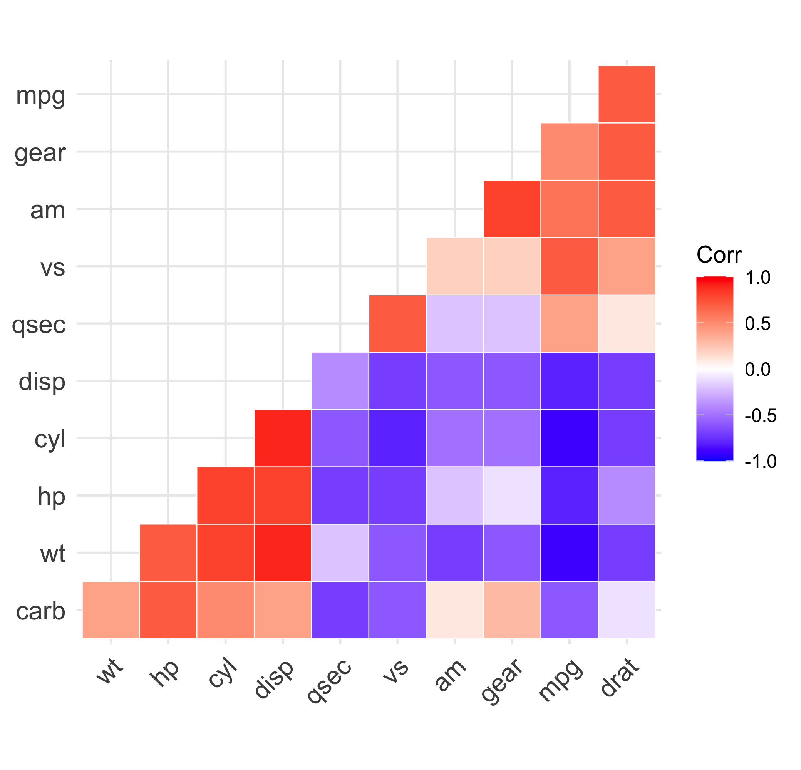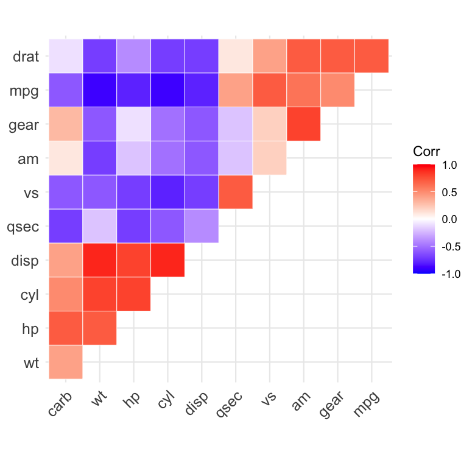

### Mixed layout

`lower.method` and `upper.method` draw a **different glyph in each
triangle** — here the coefficients as numbers below the diagonal and
circles above it, with the variable names on the diagonal.

``` r
ggcorrplot(corr,
  lower.method = "number", upper.method = "circle",
  show.legend = FALSE
)
```

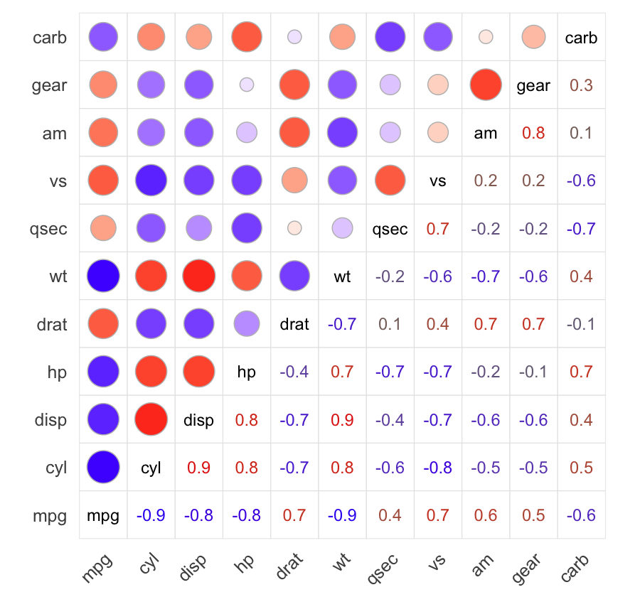

### Add the coefficients

``` r
ggcorrplot(corr, hc.order = TRUE, type = "lower", lab = TRUE)
```

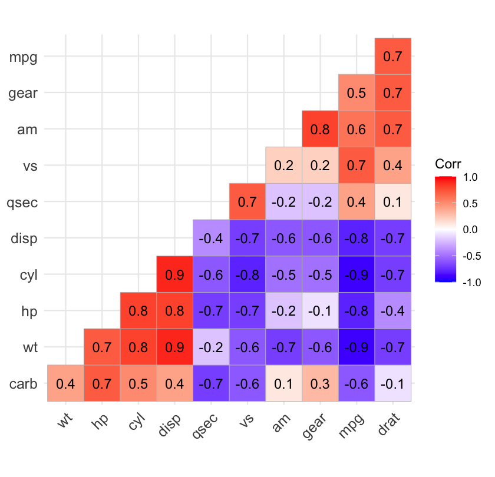

## Highlighting significance

Passing `p.mat` marks the cells whose correlation is not significant at
`sig.level` (default 0.05). By default a cross is drawn over them
(`insig = "pch"`); `insig = "blank"` hides them instead.

``` r
# Cross out the non-significant coefficients
ggcorrplot(corr, hc.order = TRUE, type = "lower", p.mat = p.mat)
# Leave them blank
ggcorrplot(corr, hc.order = TRUE, type = "lower", p.mat = p.mat, insig = "blank")
```

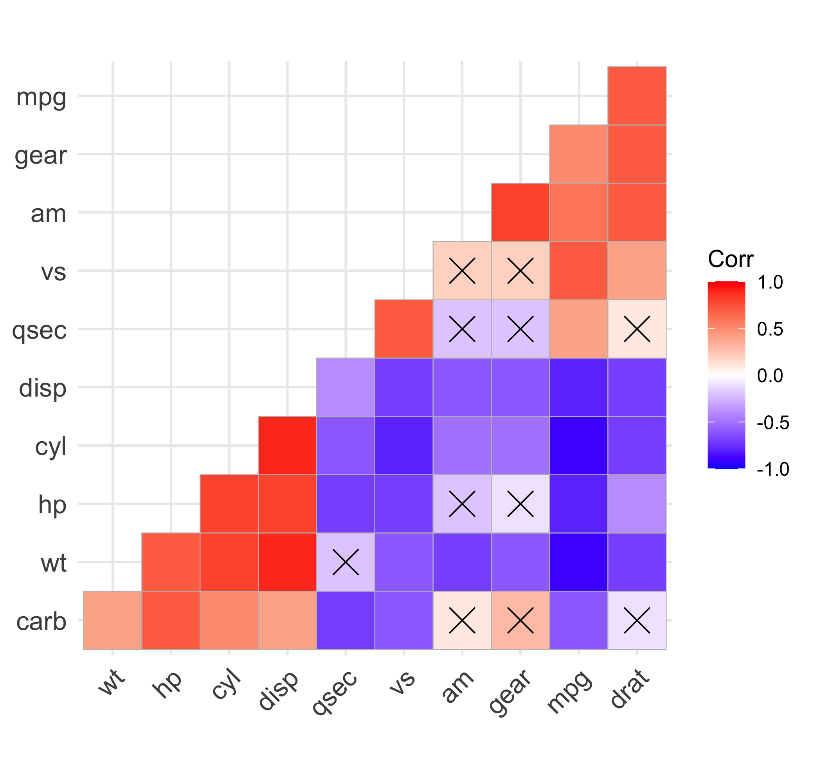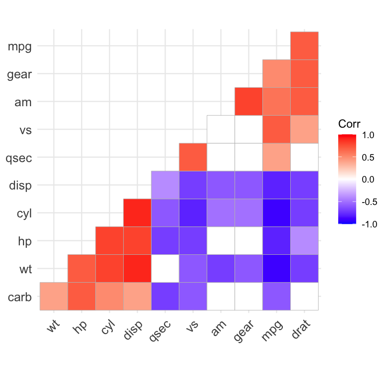

### Significance map

`insig = "stars"` flips the emphasis: instead of crossing out the
non-significant cells, it marks the **significant** ones with
significance stars (`***`, `**`, `*` for p \< 0.001, 0.01, 0.05). With
the default `lab = FALSE` this is a standalone significance map; with
`lab = TRUE` the stars are appended to the coefficients
(e.g. `-0.85***`).

``` r
ggcorrplot(corr, p.mat = p.mat, insig = "stars")
```

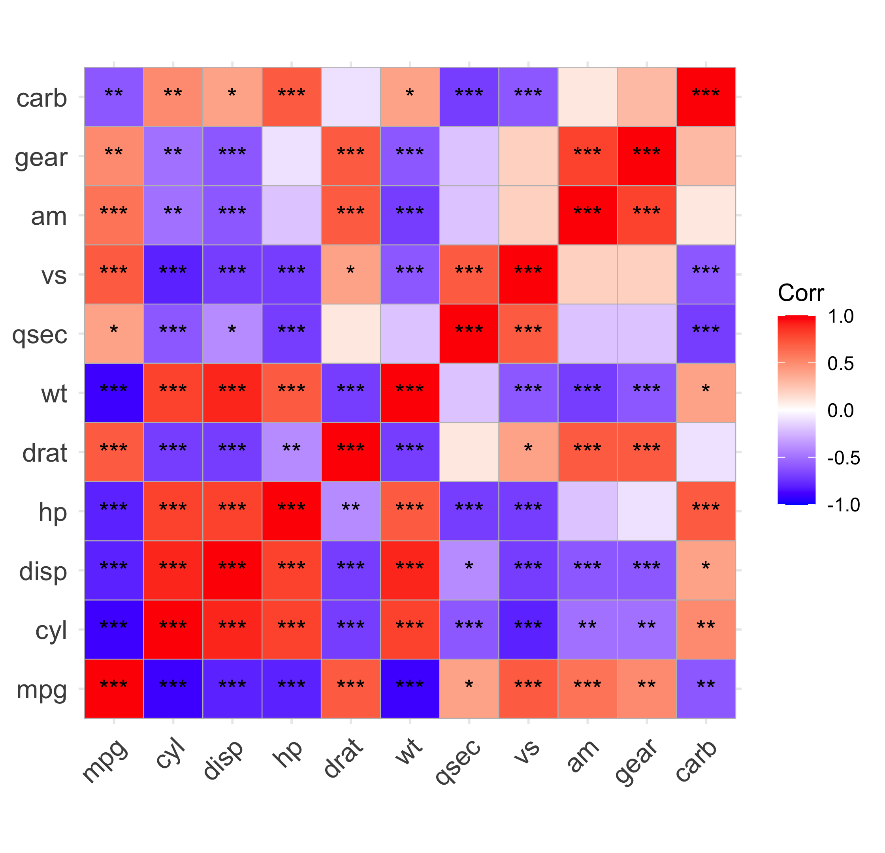

## Colors and theme

`ggcorrplot()` returns a ggplot object, so any ggplot2 theme applies.
`colors` sets the low / mid / high gradient.

``` r
ggcorrplot(corr,
  hc.order = TRUE, type = "lower", outline.color = "white",
  ggtheme = ggplot2::theme_gray,
  colors = c("#6D9EC1", "white", "#E46726")
)
```

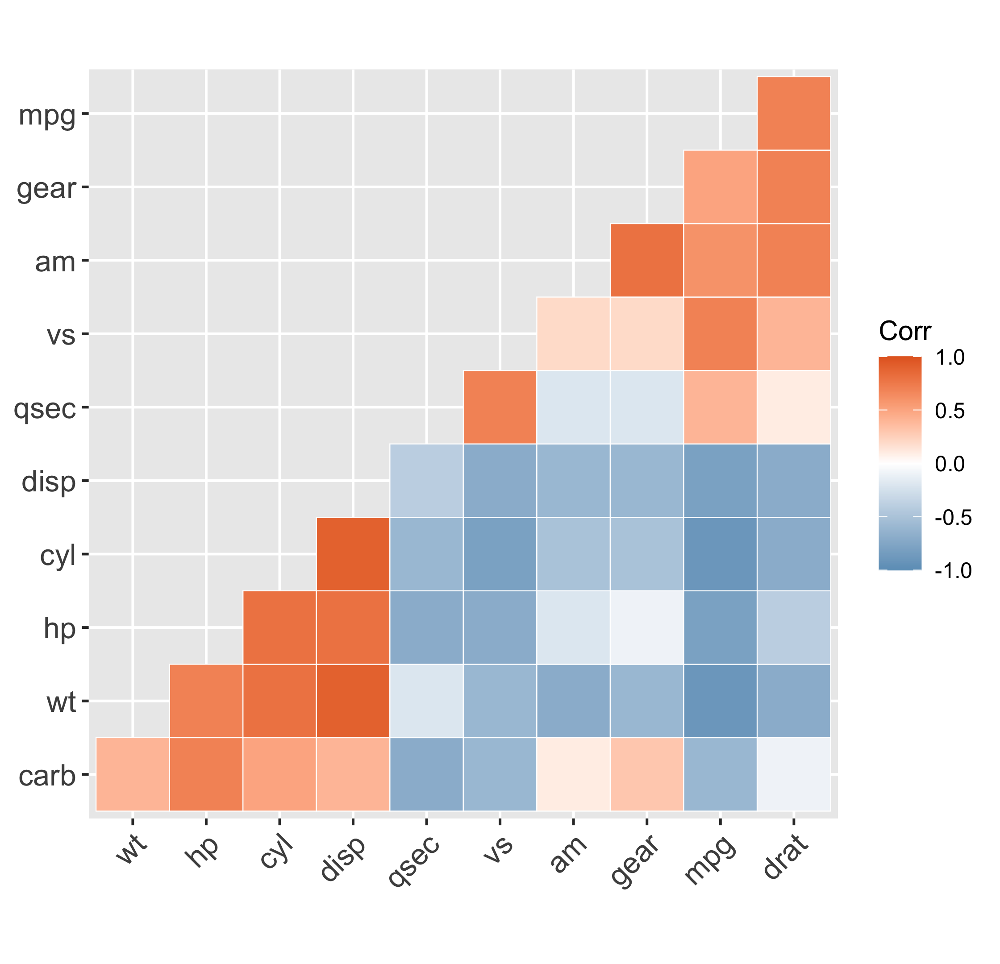
