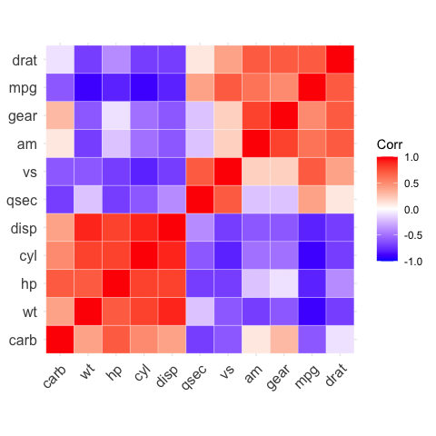

<!-- README.md is generated from README.Rmd. Please edit that file -->
[](https://travis-ci.org/kassambara/ggcorrplot) [](https://cran.r-project.org/package=ggcorrplot) [](https://cran.r-project.org/web/checks/check_results_ggcorrplot.html) [](https://github.com/kassambara/ggcorrplot)

ggcorrplot: Visualization of a correlation matrix using ggplot2
===============================================================

The **ggcorrplot** package can be used to **visualize easily** a **correlation matrix** using **ggplot2**. It provides a solution for **reordering** the correlation matrix and displays the **significance level** on the correlogram. It includes also a function for computing a matrix of **correlation p-values**.

Find out more at <http://www.sthda.com/english/wiki/ggcorrplot>.

Installation and loading
------------------------

ggcorrplot can be installed from `CRAN` as follow:

``` r
install.packages("ggcorrplot")
```

Or, install the latest version from GitHub:

``` r
# Install
if(!require(devtools)) install.packages("devtools")
devtools::install_github("kassambara/ggcorrplot")
```

``` r
# Loading
library(ggcorrplot)
```

Getting started
---------------

### Compute a correlation matrix

The *mtcars* data set will be used in the following R code. The function **cor\_pmat()** \[in **ggcorrplot**\] computes a matrix of correlation p-values.

``` r
# Compute a correlation matrix
data(mtcars)
corr <- round(cor(mtcars), 1)
head(corr[, 1:6])
#>       mpg  cyl disp   hp drat   wt
#> mpg   1.0 -0.9 -0.8 -0.8  0.7 -0.9
#> cyl  -0.9  1.0  0.9  0.8 -0.7  0.8
#> disp -0.8  0.9  1.0  0.8 -0.7  0.9
#> hp   -0.8  0.8  0.8  1.0 -0.4  0.7
#> drat  0.7 -0.7 -0.7 -0.4  1.0 -0.7
#> wt   -0.9  0.8  0.9  0.7 -0.7  1.0

# Compute a matrix of correlation p-values
p.mat <- cor_pmat(mtcars)
head(p.mat[, 1:4])
#>               mpg          cyl         disp           hp
#> mpg  0.000000e+00 6.112687e-10 9.380327e-10 1.787835e-07
#> cyl  6.112687e-10 0.000000e+00 1.802838e-12 3.477861e-09
#> disp 9.380327e-10 1.802838e-12 0.000000e+00 7.142679e-08
#> hp   1.787835e-07 3.477861e-09 7.142679e-08 0.000000e+00
#> drat 1.776240e-05 8.244636e-06 5.282022e-06 9.988772e-03
#> wt   1.293959e-10 1.217567e-07 1.222320e-11 4.145827e-05
```

Correlation matrix visualization
--------------------------------

``` r
# Visualize the correlation matrix
# --------------------------------
# method = "square" (default)
ggcorrplot(corr)
```


``` r
# method = "circle"
ggcorrplot(corr, method = "circle")
```


``` r

# Reordering the correlation matrix
# --------------------------------
# using hierarchical clustering
ggcorrplot(corr, hc.order = TRUE, outline.color = "white")
```



``` r

# Types of correlogram layout
# --------------------------------
# Get the lower triangle
ggcorrplot(corr,
           hc.order = TRUE,
           type = "lower",
           outline.color = "white")
```


``` r

# Get the upper triangle
ggcorrplot(corr,
           hc.order = TRUE,
           type = "upper",
           outline.color = "white")
```


``` r

# Change colors and theme
# --------------------------------
# Argument colors
ggcorrplot(
  corr,
  hc.order = TRUE,
  type = "lower",
  outline.color = "white",
  ggtheme = ggplot2::theme_gray,
  colors = c("#6D9EC1", "white", "#E46726")
)
```


``` r

# Add correlation coefficients
# --------------------------------
# argument lab = TRUE
ggcorrplot(corr,
           hc.order = TRUE,
           type = "lower",
           lab = TRUE)
```


``` r

# Add correlation significance level
# --------------------------------
# Argument p.mat
# Barring the no significant coefficient
ggcorrplot(corr,
           hc.order = TRUE,
           type = "lower",
           p.mat = p.mat)
```


``` r

# Leave blank on no significant coefficient
ggcorrplot(
  corr,
  p.mat = p.mat,
  hc.order = TRUE,
  type = "lower",
  insig = "blank"
)
```


